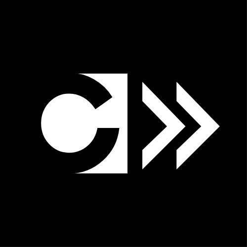

<h1 align = "center">libcvault</h1>




> A C++ library for static file metadata analysis. This repository exposes reusable APIs for directory scanning, file size inspection, filename search, and line counting.

## Documentation

- [Library reference](docs/reference.md)

## Library Overview

Code Vault is a C++ library for static file metadata analysis. It is intended to provide reusable functions for another C++ program rather than operate as a standalone executable.

## API Summary

- `populate_data()` — scan a directory and load regular file metadata
- `getTotalBytes()` — compute the total byte size of loaded files
- `getFileCount()` — return the number of loaded files
- `sortFileOnByte()` / `minMax()` — sort files by size and retrieve the largest size
- `sortFileOnName()` / `searchfile()` — sort files by name and search by filename
- `lineCount()` — count lines in a text file

## Requirements

- C++17-compatible compiler
- Standard library support for `<filesystem>`

## Build Example

```bash
git clone https://github.com/tecnolgd/libcvault
cd libcvault
g++ -std=c++17 -c main.cpp -o libcvault.o
g++ -std=c++17 my_app.cpp libcvault.o -o my_app
```

## Example Usage

```cpp
#include "head.hpp"
#include <iostream>

int main() {
    if (populate_data(".") != 0) {
        std::cerr << "Directory scan failed\n";
        return 1;
    }

    std::cout << "Files found: " << getFileCount() << "\n";
    std::cout << "Total bytes: " << getTotalBytes() << "\n";
    std::cout << "Lines in head.hpp: " << lineCount("head.hpp") << "\n";

    return 0;
}
```

## Notes
- This repository exposes a library API, not a command-line application.
- A C++17 compiler is required because the implementation depends on `<filesystem>`.
