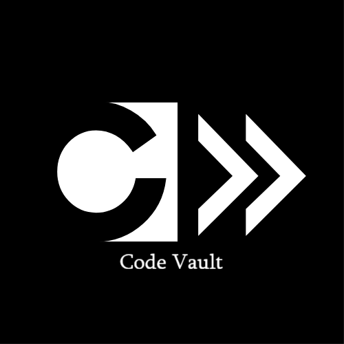

# CODE VAULT-Code Analyzer


  A **terminal** based static file analyser based on **C++** programming language through **command line operations**. Easy to use and **get insights and anaysis reports** for code files/directories.

## Documentation 📄
  
  
## Features ⚙️⚙️
* Command line interface
* Interactive mode
* Easy build and usage
* Smooth interface
* Data Analysis

## Tech Stack🚀
* Language: **C++**
* Paradigm: Object-oriented programming (**OOP**)
* Complexity: **Basic** and **Intermediate** algorithms.
* Core feature: File Handling
  
## How it works ❓️
1. The application  works on two modes.
2. Mode 1: **Interactive** mode     Mode 2: **Command-line** mode
3. The application incorporates **O**bject-**O**riented **P**rogramming concepts for file analysis.
4. The files are analyzed based on various file properties.
5.  Suitable Algorithms are used based on the functions of the analyzer.    

## Future Upgrades 🛰️
- [ ] New analysis features
- [ ] Improved time complexity
- [ ] User-friendly Commands
- [ ] Improved documentation

## How to run ?🔛
1. Clone the repository :
```bash
git clone https://github.com/tecnolgd/cvault
```
2. Open the folder :
```bash
 cd cvault
```
2) Run with  
    * ### Makefile (*Recommended*)
        1. Open terminal in the **cvault** folder. 
        2. Run ***`mingw32-make`***(for windows) / ***`make`***(for linux/ios).
        3. An executabe file called ***`cvault.exe`*** / ***`cvalut.o`*** would be formed.
        4. Run the command     
            * for **Interactive** mode:
              Use ***`cvault.exe`***(for windows cmd) or simply ***`cvault`***
              Use ***`./cvault`***(for linux/ios)  in the terminal.
            * for **Command-line** mode:
              Directly type the suitable commands on the terminal interface.

            *(Note: Run ***`mingw32-make clean`*** or ***`make clean`*** to clear object files based on OS)*
        5. The application will start for user interaction.
        ---

    * ### g++(*Manual way / for beginners*)     
        1. Open the terminal in the **cvault** folder.
        2. Run
        ```bash
        g++ main.cpp cmd.cpp -o cvault
        ```
        3. An executable file called ***`cvault.exe`*** would be formed.
        4. The command-line mode will be activated.
        5. Start writing commands based on your need. *(Refer [**documentation**]( https://tecnolgd.github.io/Code-Vault-doc) for in-depth details)*


## Recent Add-ons ➕
* [x] Documentation link
* [x] Makefile    
* [x] Discussions 
* [ ] Demo
* [ ] Improved Comments in source code


Author    
***tecnolgd***
